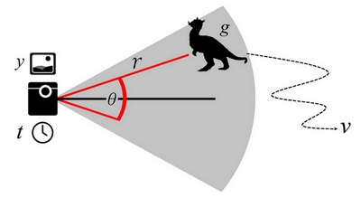
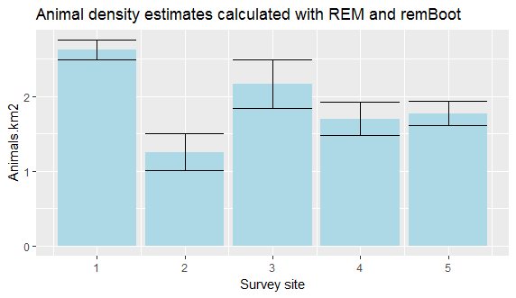

#Summary

The Random Encounter Model (REM) allows researchers to calculate population densities from camera trap data for species which do not exhibit individually-identifiable markings [@Rowcliffe2008] such as tapir (_Tapirus terrestris_; [@OliveiraSantos2010], pine marten (_Martes martes_; [@Manzo2012], and hares (_Lepus_ sp.; [@Caravaggi2016]).

Density (D) is linearly scaled with trapping rate, based on two biological variables and two camera characteristics: _g_ = average animal group size; _y_ = number of detections; _t_ = survey effort (i.e. camera hours); _v_ = average distance travelled by the species in 24 hours; _r_ = radial distance to the animal; and, _theta_ = zone of detection (Fig. 1; [@Rowcliffe2008]).

remBoot is the first package to implement REM calculations in R. The package also contains functions which allow the calculation of variance (standard deviation [SD] and/or 95% confidence intervals [CI]; Fig. 2). These calculations are computationally inexpensive and can be applied to datasets of considerable size. Densities and associated variances can be calculated for one or more sites concurrently, streamlining the analytical process.

#Acknowledgments

Thanks to Kevin Keenan for his work on implementing REMs in R early on, when the language was still very new to me, and to Bryce Mecum (`@amoeba`) for his efforts in reviewing this package.

__Figure 1.__ Data inputs (_y_ and _t_) and parameters (_r_, _v_ and _theta_) required for the calculation of population density estimates from camera trap data by the Random Encounter Model (REM). _g_ = average animal group size; _y_ = number of detections; _t_ = survey effort (i.e. camera hours); _v_ = average distance travelled by the species in 24 hours; _r_ = radial distance to the animal; and, _theta_ = zone of detection.

__Figure 2.__ Animal densities (individuals.km2) with associated variances (SD) calculated via Random Encounter Models, using remBoot.

#References
